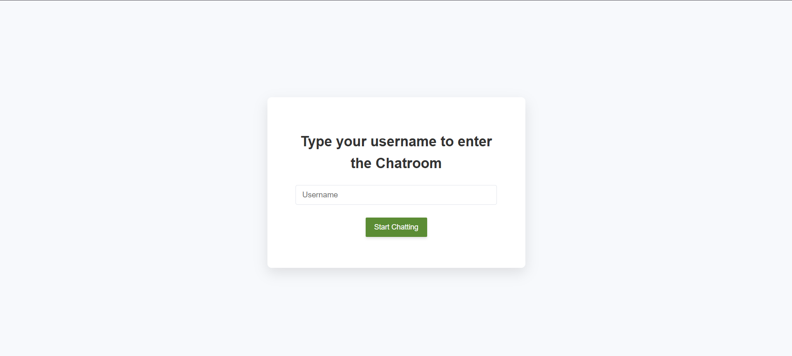
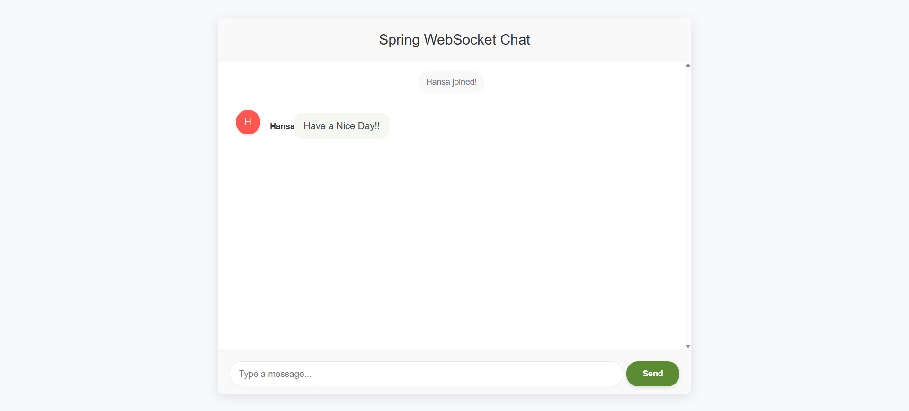

<h1 align="center">🌿 Spring Boot WebSocket Chat Application</h1>

<strong>A Modern Real-Time Chat Platform</strong>

  
  
  
  

<blockquote>
  
Connect and chat in real-time with a sleek, responsive interface powered by Spring Boot WebSockets.

</blockquote>

<h2>✨ Features</h2>

<ul>
  <li><strong>Real-time messaging</strong> - Instant message delivery with WebSockets</li>
  <li><strong>User-friendly interface</strong> - Clean, intuitive design with modern aesthetics</li>
  <li><strong>Username customization</strong> - Personalize your chat identity</li>
  <li><strong>Event notifications</strong> - See when users join or leave the chat</li>
  <li><strong>Mobile responsive</strong> - Chat from any device with a seamless experience</li>
  <li><strong>Modern UI</strong> - Subtle animations and visual feedback enhance user experience</li>
</ul>

<h2>🚀 Quick Start</h2>

<h3>Prerequisites</h3>
<ul>
  <li>Java 11+ installed</li>
  <li>Maven for dependency management</li>
</ul>

<h3>Running the Application</h3>

<ol>
  <li>
    
Clone the repository

    <pre><code>git clone https://github.com/yourusername/spring-websocket-chat.git
cd spring-websocket-chat</code></pre>
  </li>
  <li>
    
Build the project

    <pre><code>mvn clean install</code></pre>
  </li>
  <li>
    
Run the application

    <pre><code>mvn spring-boot:run</code></pre>
  </li>
  <li>
    
Open your browser and navigate to:

    <pre><code>http://localhost:8080</code></pre>
  </li>
</ol>

<h2>🔧 How It Works</h2>

This application leverages the power of WebSockets to enable real-time, bidirectional communication between clients and the server:

<ol>
  <li><strong>WebSocket Connection</strong> - Establishes a persistent connection for instant messaging</li>
  <li><strong>STOMP Messaging</strong> - Uses STOMP (Simple Text Oriented Messaging Protocol) over WebSockets</li>
  <li><strong>Spring Boot Backend</strong> - Handles message routing and user session management</li>
  <li><strong>Responsive Frontend</strong> - Delivers a consistent experience across devices</li>
</ol>

<h2>🖥️ Technical Stack</h2>

<ul>
  <li><strong>Backend</strong>: Spring Boot, Spring WebSocket</li>
  <li><strong>Frontend</strong>: HTML5, CSS3, JavaScript</li>
  <li><strong>Communication</strong>: SockJS, STOMP.js</li>
  <li><strong>Build Tool</strong>: Maven</li>
</ul>

<h2>🌟 Usage Guide</h2>

<ol>
  <li>
    
<strong>Enter the Chat Room</strong>

    <ul>
      <li>Open the application in your browser</li>
      <li>Enter your desired username</li>
      <li>Click "Start Chatting"</li>
    </ul>
  </li>
  <li>
    
<strong>Send Messages</strong>

    <ul>
      <li>Type your message in the input field</li>
      <li>Press "Send" or hit Enter</li>
      <li>Your message will appear instantly for all connected users</li>
    </ul>
  </li>
  <li>
    
<strong>Chat Notifications</strong>

    <ul>
      <li>Receive automatic notifications when users join or leave</li>
      <li>See typing indicators (coming soon)</li>
    </ul>
  </li>
</ol>

<h2>🛠️ Customization</h2>

Feel free to customize this application by:

<ul>
  <li>Changing the color scheme in <code>main.css</code></li>
  <li>Adding user avatars or profile pictures</li>
  <li>Implementing private messaging</li>
  <li>Adding file sharing capabilities</li>
  <li>Creating themed chat rooms</li>
</ul>

<h2>📱 Mobile Support</h2>

The application is fully responsive and works on:

<ul>
  <li>📱 Smartphones</li>
  <li>📱 Tablets</li>
  <li>💻 Desktops</li>
  <li>💻 Laptops</li>
</ul>

<h2>🤝 Contributing</h2>

Contributions are welcome! Feel free to:

<ol>
  <li>Fork the repository</li>
  <li>Create a feature branch (<code>git checkout -b feature/amazing-feature</code>)</li>
  <li>Commit your changes (<code>git commit -m 'Add some amazing feature'</code>)</li>
  <li>Push to the branch (<code>git push origin feature/amazing-feature</code>)</li>
  <li>Open a Pull Request</li>
</ol>

<h2>📝 License</h2>

This project is licensed under the MIT License - see the LICENSE file for details.

<h2>🙏 Acknowledgements</h2>

<ul>
  <li>Spring Boot team for the excellent WebSocket support</li>
  <li>SockJS and STOMP.js for robust client-side implementations</li>
  <li>All contributors and testers who helped shape this application</li>
</ul>

Happy chatting! 💬✨

